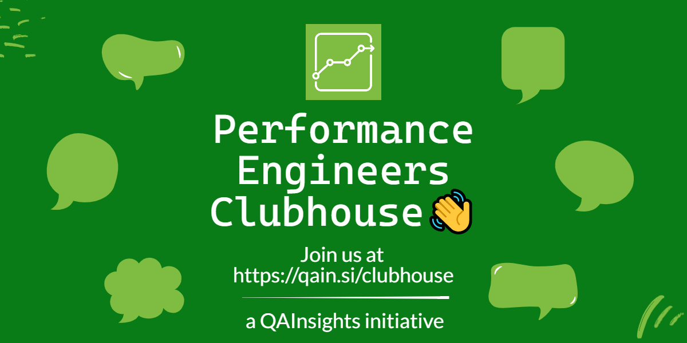

# 👋 Welcome to Performance Engineers Clubhouse!

    

# 🎯 Objective

> To learn and share all things about performance testing, engineering, SRE, DevOps and more.

# 🤝 How to join?

Clubhouse is now open to all, here is the [direct link](https://www.clubhouse.com/club/performance-engineers) to join.

# 📲 Meetings

> [Time Zone Converter](https://www.worldtimebuddy.com)  
> [Event Time Announcer](https://www.timeanddate.com/worldclock/fixedtime.html?msg=Performance+Engineers+Clubhouse+Meet&iso=20210904T11&p1=414&ah=1&am=30)

|Date & Time | Topics | Link |
|--|--|--|
| Jun 18 2021 - 09.00 PM EST | Weekly Performance Pod - Kickoff | |
| Jun 26 2021 - 11.00 AM EST | Which tools we need to learn right now? | |
| Jul 03 2021 - 11.30 AM EST | Analyzing Test Results - Tips & Tricks | [Invite](https://www.clubhouse.com/event/P9K7NgLA) |
| Jul 09 2021 - 11.30 AM EST | Shift-Left Performance Testing  | [Invite](https://www.clubhouse.com/join/performance-engineers/dUkV1zI0/MRDp8LVE) |
| Jul 17 2021 - 10.00 AM EST | Java Performance - Guest Speaker: Ram Lakshmanan  | [Invite](https://www.clubhouse.com/join/performance-engineers/rPsHTge0/xB0Kj016) |
| Jul 24 2021 - 11.00 AM EST | Load Testing with RedLine13 - Guest Speaker: Richard Friedman  | [Invite](https://www.clubhouse.com/event/xp1v57rj) |
| Jul 31 2021 - 11.00 AM EST | Resume and Interview Tips  | [Join](https://www.clubhouse.com/join/performance-engineers/hHzngkSY/xlj3E19L) |
| Aug 07 2021 - 11.00 AM EST | Realistic Load Testing - Guest Speaker: Nicole van der Hoeven  | [Join](https://www.clubhouse.com/join/performance-engineers/guivekjO/m2j1DzDq) |
| Aug 14 2021 - 11.00 AM EST | Recording and Scripting Challenges  | [Join](https://www.clubhouse.com/join/performance-engineers/H10OB0zQ/PY4Y3AdO) |
| Aug 21 2021 - 11.00 AM EST | Evolution of Chaos Engineering - Guest Speaker: Karthik Satchitanand  | [Join](https://www.clubhouse.com/join/performance-engineers/mVMWveXd/xpXlkNLq) |
| Aug 28 2021 - 11.30 AM EST | JMeter Productivity Hacks  | [Join](https://www.clubhouse.com/join/performance-engineers/hJoe3lox/myw40NBe) |
| Sep 03 2021 - 11.00 AM EST | Performance Test Report  | [Join](https://www.clubhouse.com/join/performance-engineers/utGzTx9E/xpXWZ79L) |
| Sep 11 2021 - 11.00 AM EST | Let Us Observe  | [Join](https://www.clubhouse.com/join/performance-engineers/RFkjwB6z/mgjA8L2M) |
| Sep 18 2021 - 11.30 AM EST | The Hitchhiking Guide To Load Testing Projects - Guest Speaker: Leandro Melendez  | [Join](https://www.clubhouse.com/join/performance-engineers/wPfHP4tv/m3Yn8oRk) |
| Sep 25 2021 - 11.00 AM EST | Global Last-Mile Load Testing - Guest Speaker: Llyod Watts  | [Join](https://www.clubhouse.com/join/performance-engineers/nFYKMqmr/xVKOO1J0) |
| Oct 02 2021 - 11.00 AM EST | Correlation Techniques  | [Join](https://www.clubhouse.com/join/performance-engineers/igWLec05/PD9knNYo) |
| Oct 16 2021 - 11.00 AM EST | A Day in SRE’s Life w/ Shivam Mitra | [Join](https://www.clubhouse.com/join/performance-engineers/F9OteAPu/mgnywAK2) |
| Oct 23 2021 - 11.00 AM EST | Performance Testing Certifications | [Join](https://www.clubhouse.com/event/MEA3JA0p) |
| Oct 30 2021 - 11.00 AM EST | Collaboration in Performance Testing | [Join](https://www.clubhouse.com/event/mJo5Xdan) |
| Nov 06 2021 - 11.00 AM EST | Ask Me Anything | [Join](#) |
| Nov 13 2021 - 11.00 AM EST | Automating Performance Test Results and Analysis | [Join](https://www.clubhouse.com/event/MdAdn967) |
| Nov 20 2021 - 11.00 AM EST | Deep dive into Stress Testing | [Join](https://www.clubhouse.com/event/mWV7o00Y) |
| Jan 07 2022 - 11.00 AM EST | Interview Preparation - AMA | [Join](https://www.clubhouse.com/room/xjYj7E4k0) |

# 📽 Recordings

Please check [QAInsights YouTube playlist](https://youtube.com/playlist?list=PLJ9A48W0kpRJeKrDiNyFpUUlazU_aiPWM) for the recordings.

# 👥 Members Count

**500+**

# ⚠ Rules

* Please stick to the topic
* Please be kind and polite
* When you are on stage, please mute yourself
* No SPAM and adverts without prior permission

# 💰 To sponsor the talks

Please contact us at 📩 [here](mailto:contact@qainsights.com).

# Appendix

## About Clubhouse

* [Clubhouse Community Guidelines](https://www.notion.so/Community-Guidelines-461a6860abda41649e17c34dc1dd4b5f)
